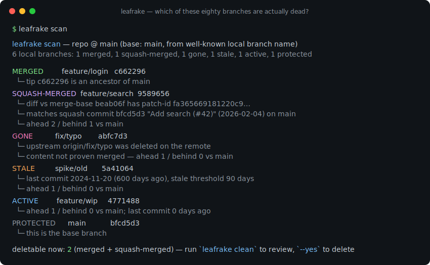
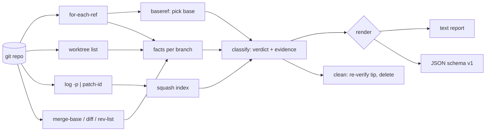

# leafrake

[English](README.md) | [中文](README.zh.md) | [日本語](README.ja.md)

[](LICENSE) [](go.mod) [](CHANGELOG.md)  [](CONTRIBUTING.md)

**leafrake：ローカルの git ブランチをマージ済み・squash マージ済み・陳腐化・上流消失に分類し、ブランチごとの証拠付きで死んだブランチを削除する、オープンソースのゼロ依存 CLI。`git branch --merged` には見えない squash マージを捕捉する。**



```bash
git clone https://github.com/JaydenCJ/leafrake && cd leafrake
go build -o leafrake ./cmd/leafrake    # single static binary, stdlib only
```

> プレリリース：v0.1.0 はまだどのパッケージレジストリにも公開されていません。上記の手順でソースからビルドしてください（Go ≥1.22 なら何でも可）。

## なぜ leafrake？

半年以上経ったリポジトリで `git branch` を実行すると、八十本の死んだブランチが画面を流れていく。定番の掃除法 `git branch --merged | xargs git branch -d` は現代のワークフローでは壊れている：主要なフォージはデフォルトで squash マージし、squash されたブランチの tip はベースの祖先では*ない*——だから `--merged` には決して現れず、`git branch -d` は削除を拒み、ベテランのエンジニアでさえ最後は勘で強制削除する羽目になる。squash を扱えるツールにもそれぞれコストがある：git-trim はリポジトリごとの設定とフラグの吟味を要求し、git-sweep は本物のマージしか理解しない。leafrake は別の立場を取る：**ゼロ設定、そして勘では決して削除しない**。ベースブランチを自力で検出し（origin/HEAD、次に main/master/trunk/develop）、各ブランチの「landed するはずだった squash コミット」を合成してその patch-id をベースと照合することで squash マージを証明し、何かを削除する前に証拠——正確な着地コミット、上流の状態、祖先関係——をすべての判定の隣に提示する。削除はデフォルトでドライラン、証明済みカテゴリに限定され、削除された各ブランチには実際に使える復元コマンドが付く。

| | leafrake | `git branch --merged` | git-trim | git-sweep |
|---|---|---|---|---|
| squash マージを検出 | ✅ patch-id による証明 | ❌ | ✅ | ❌ |
| 削除前にブランチごとの証拠を表示 | ✅ squash コミットと上流状態を引用 | ❌ | ❌ 判定のみ | ❌ |
| 必要な設定 | なし | なし | 非デフォルトのベースはリポジトリごとに設定 | リモート設定が必要 |
| 陳腐化 / 上流消失の分類 | ✅ 削除はオプトイン | ❌ | ✅ | ❌ |
| HEAD・worktree・ベースの保護 | ✅ 自動 | ⚠️ HEAD のみ | ✅ | ⚠️ |
| 削除後のアンドゥ | ✅ 復元コマンドを表示 | ❌ | ❌ | ❌ |
| ランタイム依存 | 0（Go 標準ライブラリ） | 0（内蔵） | Rust バイナリ + libgit2 | Python + 依存 |

<sub>依存数の確認日 2026-07-12：leafrake は Go 標準ライブラリのみを import しローカルの `git` を呼ぶだけ；git-trim は libgit2 をリンク；git-sweep（Python）は GitPython などを PyPI から取得。</sub>

## 特徴

- **squash マージは推測ではなく証明** — 各ブランチが単一コミットとして landed するはずだった diff を合成し、`git patch-id --stable` でハッシュ化してベースブランチのコミット群と照合。ヒットすれば正確な squash コミット（ハッシュ・件名・日付）を証拠として引用する。
- **証拠があってこその削除** — すべての判定に理由が付く：祖先関係、一致したコミット、上流の `[gone]` 状態、ahead/behind 数、最終コミットの経過日数。`leafrake explain <branch>` は一本のブランチの完全な調書を出力する。
- **ゼロ設定** — ベースブランチは `origin/HEAD` から自動検出し、`main`/`master`/`trunk`/`develop` にフォールバック；陳腐化のしきい値はデフォルト 90 日。フラグは揃っているが、素の `leafrake` だけで正しく動く。
- **デフォルトで安全** — `clean` は `--yes` を付けるまで常にドライラン；`--select gone,stale` を明示しない限り*証明済み*カテゴリ（merged、squash-merged）だけを削除；HEAD・リンクされた worktree・ベースブランチ・`--protect` の glob には決して触れない。
- **アンドゥ内蔵** — 各削除の直前に tip ハッシュを再検証し（スキャン後に動いたブランチは削除ではなくスキップ）、`restore: git branch <name> <hash>` を出力する——git が到達不能オブジェクトを回収するまで、これは本当に機能する。
- **スクリプトから使える** — `scan` と `clean` 双方に安定した JSON 出力（`schema_version: 1`）、さらに削除可能なブランチが存在する間は終了コード 1 を返す `scan --check`。シェルプロンプトや pre-push フックにそのまま使える。
- **ゼロ依存・完全オフライン** — Go 標準ライブラリのみ；対話する相手はローカルの `git` だけ。テレメトリなし、ネットワーク通信は一切なし。

## クイックスタート

```bash
# build a demo repository (one branch of every category, local bare "remote")
bash examples/make-messy-repo.sh /tmp/leafrake-demo
./leafrake scan /tmp/leafrake-demo/repo
```

実際にキャプチャした出力：

```text
leafrake scan — repo @ main (base: main, from well-known local branch name)
6 local branches: 1 merged, 1 squash-merged, 1 gone, 1 stale, 1 active, 1 protected

MERGED         feature/login   c662296
  └─ tip c662296 is an ancestor of main
SQUASH-MERGED  feature/search  9589656
  └─ diff vs merge-base beab06f has patch-id fa365669181220c9…
  └─ matches squash commit bfcd5d3 "Add search (#42)" (2026-02-04) on main
  └─ ahead 2 / behind 1 vs main
GONE           fix/typo        abfc7d3
  └─ upstream origin/fix/typo was deleted on the remote
  └─ content not proven merged — ahead 1 / behind 0 vs main
STALE          spike/old       5a41064
  └─ last commit 2024-11-20 (600 days ago), stale threshold 90 days
  └─ ahead 1 / behind 0 vs main
ACTIVE         feature/wip     4771488
  └─ ahead 1 / behind 0 vs main; last commit 0 days ago
PROTECTED      main            bfcd5d3
  └─ this is the base branch

deletable now: 2 (merged + squash-merged) — run `leafrake clean` to review, `--yes` to delete
```

二番目のブロックに注目：`git branch --merged main` は `feature/search` を**列挙しない**——それを捕まえるのが patch-id 証明だ。続いて削除（実際の出力）：

```text
leafrake clean — selection: merged, squash-merged

deleted       feature/login   merged         was c662296
  └─ restore: git branch feature/login c662296
deleted       feature/search  squash-merged  was 9589656
  └─ restore: git branch feature/search 9589656

2 deleted, 0 failed
```

## 分類リファレンス

完全なルールと squash 証明アルゴリズムは [docs/classification.md](docs/classification.md) を参照。

| カテゴリ | 証明 / シグナル | デフォルトの `clean` で削除 |
|---|---|---|
| `merged` | tip がベースの祖先、または merge-base に対し差分ゼロ | ✅ |
| `squash-merged` | ブランチ diff の patch-id がベースのコミットに一致（証拠として引用） | ✅ |
| `gone` | 上流が設定済みだがリモートで削除済み；マージは未証明 | オプトイン `--select gone` |
| `stale` | 最終コミットが `--stale-days`（デフォルト 90）日以上前 | オプトイン `--select stale` |
| `active` | それ以外すべて | 削除しない |
| `protected` | ベース、HEAD、worktree チェックアウト、`--protect` 一致 | 削除しない |

## CLI リファレンス

`leafrake [scan|clean|explain|version] [flags] [path]` — デフォルトのサブコマンドは `scan`。終了コード：0 正常、1 削除可能ブランチあり（`--check`）または削除失敗、2 使い方エラー、3 実行時エラー。

| フラグ | デフォルト | 効果 |
|---|---|---|
| `--base` | 自動検出 | 比較対象のベースブランチ（`origin/main` も可） |
| `--stale-days` | `90` | 陳腐化しきい値（日）；`0` で stale ルールを無効化 |
| `--squash-window` | `1000` | squash 検出のためにインデックスするベースコミット数 |
| `--protect` | — | この glob に一致するブランチには決して触れない（繰り返し可） |
| `--format` | `text` | `text` または `json`（scan と clean） |
| `--check`（scan） | オフ | 削除可能なブランチが存在すれば終了コード 1 |
| `--select`（clean） | `merged,squash-merged` | 削除するカテゴリ：カンマ区切り、`gone`・`stale` を追加可 |
| `--yes`（clean） | オフ | 実際に削除する；付けなければ clean はドライラン |

## 検証

このリポジトリは CI を同梱しない。上記のすべての主張はローカル実行で検証されている：

```bash
go test ./...            # 90 deterministic tests, offline, < 10 s
bash scripts/smoke.sh    # end-to-end CLI check, prints SMOKE OK
```

## アーキテクチャ



## ロードマップ

- [x] v0.1.0 — merged / squash-merged / gone / stale の分類とブランチごとの証拠、patch-id による squash 証明、ゼロ設定のベース検出、復元ヒント付きドライラン clean、JSON 出力、`scan --check` ゲート、90 テスト + smoke スクリプト
- [ ] rebase マージ検出（`git cherry` 的なコミット単位の patch-id）
- [ ] インタラクティブモード：削除前に証拠リストからブランチを選択
- [ ] `--remote` ツイン掃除：ローカルでの証明後に `origin/<branch>` を削除
- [ ] PR ボットのコメント向け Markdown 証拠レポート
- [ ] シェル補完（bash、zsh、fish）

完全なリストは [open issues](https://github.com/JaydenCJ/leafrake/issues) を参照。

## コントリビュート

Issue・ディスカッション・プルリクエストを歓迎——ローカルのワークフロー（フォーマット、vet、テスト、`SMOKE OK`）は [CONTRIBUTING.md](CONTRIBUTING.md) を参照。入門しやすいタスクには [good first issue](https://github.com/JaydenCJ/leafrake/issues?q=is%3Aissue+is%3Aopen+label%3A%22good+first+issue%22) のラベルが付き、設計の議論は [Discussions](https://github.com/JaydenCJ/leafrake/discussions) で。

## ライセンス

[MIT](LICENSE)
