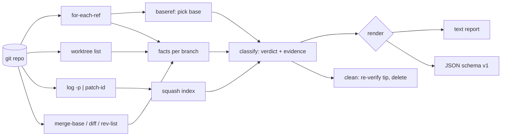

# leafrake

[English](README.md) | [中文](README.zh.md) | [日本語](README.ja.md)

[](LICENSE) [](go.mod) [](CHANGELOG.md)  [](CONTRIBUTING.md)

**leafrake：an open-source, zero-dependency CLI that classifies every local git branch — merged, squash-merged, stale, gone — and deletes the dead ones with per-branch proof, catching the squash merges `git branch --merged` can't see.**


```bash
git clone https://github.com/JaydenCJ/leafrake && cd leafrake
go build -o leafrake ./cmd/leafrake    # single static binary, stdlib only
```

> Pre-release: v0.1.0 is not tagged on a package registry yet; build from source as above (any Go ≥1.22).

## Why leafrake?

Run `git branch` in any repository older than six months and eighty dead branches scroll past. The obvious cleanup, `git branch --merged | xargs git branch -d`, is broken on modern workflows: every major forge squash-merges by default, and a squashed branch's tip is *not* an ancestor of the base — so `--merged` never lists it, `git branch -d` refuses to delete it, and even senior engineers end up force-deleting on faith. The tools that do handle squashes have their own costs: git-trim wants per-repo configuration and stewing over flags; git-sweep only understands real merges. leafrake takes a different position: **zero configuration, and never delete on faith**. It detects the base branch on its own (origin/HEAD, then main/master/trunk/develop), proves squash merges by synthesizing each branch's would-be squash commit and matching its patch-id against the base, and shows the evidence — the exact landing commit, the upstream state, the ancestry — next to every verdict before anything is deleted. Deletion is dry-run by default, restricted to proven categories, and every deleted branch comes with a working restore command.

| | leafrake | `git branch --merged` | git-trim | git-sweep |
|---|---|---|---|---|
| Detects squash merges | ✅ patch-id proof | ❌ | ✅ | ❌ |
| Shows per-branch evidence before deleting | ✅ quoted squash commit, upstream state | ❌ | ❌ verdict only | ❌ |
| Configuration required | none | none | per-repo config for non-default bases | remote setup |
| Stale / gone classification | ✅ opt-in deletion | ❌ | ✅ | ❌ |
| Protects HEAD, worktrees, base | ✅ automatic | ⚠️ HEAD only | ✅ | ⚠️ |
| Undo after deletion | ✅ printed restore command | ❌ | ❌ | ❌ |
| Runtime dependencies | 0 (Go stdlib) | 0 (built-in) | Rust binary + libgit2 | Python + deps |

<sub>Dependency counts checked 2026-07-12: leafrake imports the Go standard library only and shells out to your local `git`; git-trim links libgit2; git-sweep (Python) pulls GitPython and friends from PyPI.</sub>

## Features

- **Squash-merge proof, not guesswork** — synthesizes the single diff each branch would have landed as, hashes it with `git patch-id --stable`, and matches it against the base branch's commits; a hit quotes the exact squash commit (hash, subject, date) as evidence.
- **Evidence before deletion** — every verdict carries its reasons: ancestry, matching commit, upstream `[gone]` state, ahead/behind counts, last-commit age. `leafrake explain <branch>` prints the full dossier for one branch.
- **Zero configuration** — the base branch is auto-detected from `origin/HEAD`, falling back to `main`/`master`/`trunk`/`develop`; staleness defaults to 90 days. Flags exist, but a bare `leafrake` already does the right thing.
- **Safe by default** — `clean` is a dry run until `--yes`; only *proven* categories (merged, squash-merged) are deleted unless you opt into `--select gone,stale`; HEAD, linked worktrees, the base branch, and `--protect` globs are never touched.
- **Undo built in** — each deletion re-verifies the tip hash first (a branch that moved since the scan is skipped, not deleted) and prints `restore: git branch <name> <hash>`, which genuinely works until git prunes unreachable objects.
- **Scriptable** — stable JSON output (`schema_version: 1`) for both `scan` and `clean`, plus `scan --check` exiting 1 while deletable branches exist, ready for shell prompts and pre-push hooks.
- **Zero dependencies, fully offline** — Go standard library only; the only thing it ever talks to is your local `git`. No telemetry, no network, ever.

## Quickstart

```bash
# build a demo repository (one branch of every category, local bare "remote")
bash examples/make-messy-repo.sh /tmp/leafrake-demo
./leafrake scan /tmp/leafrake-demo/repo
```

Real captured output:

```text
leafrake scan — repo @ main (base: main, from well-known local branch name)
6 local branches: 1 merged, 1 squash-merged, 1 gone, 1 stale, 1 active, 1 protected

MERGED         feature/login   c662296
  └─ tip c662296 is an ancestor of main
SQUASH-MERGED  feature/search  9589656
  └─ diff vs merge-base beab06f has patch-id fa365669181220c9…
  └─ matches squash commit bfcd5d3 "Add search (#42)" (2026-02-04) on main
  └─ ahead 2 / behind 1 vs main
GONE           fix/typo        abfc7d3
  └─ upstream origin/fix/typo was deleted on the remote
  └─ content not proven merged — ahead 1 / behind 0 vs main
STALE          spike/old       5a41064
  └─ last commit 2024-11-20 (600 days ago), stale threshold 90 days
  └─ ahead 1 / behind 0 vs main
ACTIVE         feature/wip     4771488
  └─ ahead 1 / behind 0 vs main; last commit 0 days ago
PROTECTED      main            bfcd5d3
  └─ this is the base branch

deletable now: 2 (merged + squash-merged) — run `leafrake clean` to review, `--yes` to delete
```

Note the second block: `git branch --merged main` does **not** list `feature/search` — the patch-id proof is what catches it. Then delete (real output):

```text
leafrake clean — selection: merged, squash-merged

deleted       feature/login   merged         was c662296
  └─ restore: git branch feature/login c662296
deleted       feature/search  squash-merged  was 9589656
  └─ restore: git branch feature/search 9589656

2 deleted, 0 failed
```

## Classification reference

Full rules and the squash-proof algorithm live in [docs/classification.md](docs/classification.md).

| Category | Proof / signal | Deleted by default `clean` |
|---|---|---|
| `merged` | tip is an ancestor of base, or net-zero diff vs merge-base | ✅ |
| `squash-merged` | branch diff patch-id matches a base commit (quoted as evidence) | ✅ |
| `gone` | upstream configured but deleted on the remote; merge not proven | opt-in `--select gone` |
| `stale` | last commit ≥ `--stale-days` (default 90) days old | opt-in `--select stale` |
| `active` | everything else | never |
| `protected` | base, HEAD, worktree checkouts, `--protect` matches | never |

## CLI reference

`leafrake [scan|clean|explain|version] [flags] [path]` — `scan` is the default. Exit codes: 0 ok, 1 deletable branches found (`--check`) or a deletion failed, 2 usage error, 3 runtime error.

| Flag | Default | Effect |
|---|---|---|
| `--base` | auto-detect | base branch to compare against (may be `origin/main`) |
| `--stale-days` | `90` | staleness threshold in days; `0` disables the stale rule |
| `--squash-window` | `1000` | how many base commits to index for squash detection |
| `--protect` | — | never touch branches matching this glob (repeatable) |
| `--format` | `text` | `text` or `json` (scan and clean) |
| `--check` (scan) | off | exit 1 when deletable branches exist |
| `--select` (clean) | `merged,squash-merged` | categories to delete: comma list, may add `gone`,`stale` |
| `--yes` (clean) | off | actually delete; without it clean is a dry run |

## Verification

This repository ships no CI; every claim above is verified by local runs:

```bash
go test ./...            # 90 deterministic tests, offline, < 10 s
bash scripts/smoke.sh    # end-to-end CLI check, prints SMOKE OK
```

## Architecture



## Roadmap

- [x] v0.1.0 — merged / squash-merged / gone / stale classification with per-branch evidence, patch-id squash proof, zero-config base detection, dry-run clean with restore hints, JSON output, `scan --check` gate, 90 tests + smoke script
- [ ] Rebase-merge detection (per-commit patch-ids via `git cherry` semantics)
- [ ] Interactive mode: pick branches from the evidence list before deleting
- [ ] `--remote` twin cleanup: delete `origin/<branch>` after the local proof
- [ ] Markdown evidence report for PR-bot comments
- [ ] Shell completions (bash, zsh, fish)

See the [open issues](https://github.com/JaydenCJ/leafrake/issues) for the full list.

## Contributing

Issues, discussions and pull requests are welcome — see [CONTRIBUTING.md](CONTRIBUTING.md) for the local workflow (format, vet, tests, `SMOKE OK`). Good entry points are labelled [good first issue](https://github.com/JaydenCJ/leafrake/issues?q=is%3Aissue+is%3Aopen+label%3A%22good+first+issue%22), and design questions live in [Discussions](https://github.com/JaydenCJ/leafrake/discussions).

## License

[MIT](LICENSE)
