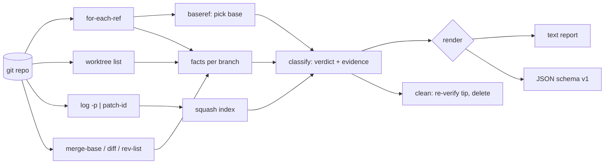

# leafrake

[English](README.md) | [中文](README.zh.md) | [日本語](README.ja.md)

[](LICENSE) [](go.mod) [](CHANGELOG.md)  [](CONTRIBUTING.md)

**leafrake：开源、零依赖的 CLI，把每个本地 git 分支分类为已合并、squash 合并、陈旧、上游已删——并附上逐分支证据后删除死分支，捕捉 `git branch --merged` 看不见的 squash 合并。**


```bash
git clone https://github.com/JaydenCJ/leafrake && cd leafrake
go build -o leafrake ./cmd/leafrake    # single static binary, stdlib only
```

> 预发布：v0.1.0 尚未发布到任何包注册表；请按上述方式从源码构建（任意 Go ≥1.22）。

## 为什么选 leafrake？

在任何超过半年的仓库里运行 `git branch`，八十个死分支会滚屏而过。显而易见的清理方式 `git branch --merged | xargs git branch -d` 在现代工作流下是坏的：各大代码托管平台默认 squash 合并，而被 squash 的分支其 tip *不是*基线分支的祖先——所以 `--merged` 永远列不出它，`git branch -d` 拒绝删除它，连资深工程师最后也只能凭感觉强制删除。能处理 squash 的工具又各有代价：git-trim 需要按仓库配置、琢磨各种 flag；git-sweep 只认识真正的 merge。leafrake 选择了另一条路：**零配置，且绝不凭感觉删除**。它自行探测基线分支（origin/HEAD，然后 main/master/trunk/develop），通过合成每个分支"本应落地的 squash 提交"并将其 patch-id 与基线比对来证明 squash 合并，并在删除任何东西之前把证据——确切的落地提交、上游状态、祖先关系——摆在每个结论旁边。删除默认是演练（dry run），只限已证明的类别，且每个被删分支都附带一条可用的恢复命令。

| | leafrake | `git branch --merged` | git-trim | git-sweep |
|---|---|---|---|---|
| 检测 squash 合并 | ✅ patch-id 证明 | ❌ | ✅ | ❌ |
| 删除前展示逐分支证据 | ✅ 引用 squash 提交、上游状态 | ❌ | ❌ 只有结论 | ❌ |
| 所需配置 | 无 | 无 | 非默认基线需按仓库配置 | 需配置远端 |
| 陈旧 / 上游已删分类 | ✅ 删除需显式选择 | ❌ | ✅ | ❌ |
| 保护 HEAD、worktree、基线 | ✅ 自动 | ⚠️ 仅 HEAD | ✅ | ⚠️ |
| 删除后可撤销 | ✅ 打印恢复命令 | ❌ | ❌ | ❌ |
| 运行时依赖 | 0（Go 标准库） | 0（内置） | Rust 二进制 + libgit2 | Python + 依赖 |

<sub>依赖数量核对于 2026-07-12：leafrake 只导入 Go 标准库并调用本地 `git`；git-trim 链接 libgit2；git-sweep（Python）从 PyPI 拉取 GitPython 等依赖。</sub>

## 功能

- **squash 合并靠证明，不靠猜** — 合成每个分支本应作为单个提交落地的 diff，用 `git patch-id --stable` 计算哈希，与基线分支的提交比对；命中时引用确切的 squash 提交（哈希、标题、日期）作为证据。
- **先有证据再删除** — 每个结论都带着理由：祖先关系、匹配的提交、上游 `[gone]` 状态、领先/落后计数、最后提交的年龄。`leafrake explain <branch>` 打印单个分支的完整档案。
- **零配置** — 基线分支自动从 `origin/HEAD` 探测，回退到 `main`/`master`/`trunk`/`develop`；陈旧阈值默认 90 天。flag 都有，但裸的 `leafrake` 已经做对了。
- **默认安全** — `clean` 在加 `--yes` 之前始终是演练；除非显式选择 `--select gone,stale`，否则只删除*已证明*的类别（merged、squash-merged）；HEAD、关联 worktree、基线分支和 `--protect` 通配符永不触碰。
- **内建撤销** — 每次删除先重新校验 tip 哈希（扫描后移动过的分支会被跳过而非删除），并打印 `restore: git branch <name> <hash>`——在 git 清理不可达对象之前，它真的有效。
- **可脚本化** — `scan` 和 `clean` 都有稳定的 JSON 输出（`schema_version: 1`），加上 `scan --check` 在存在可删分支时以退出码 1 结束，可直接用于 shell 提示符和 pre-push 钩子。
- **零依赖、完全离线** — 只用 Go 标准库；它唯一交流的对象是你本地的 `git`。没有遥测，永不联网。

## 快速上手

```bash
# build a demo repository (one branch of every category, local bare "remote")
bash examples/make-messy-repo.sh /tmp/leafrake-demo
./leafrake scan /tmp/leafrake-demo/repo
```

真实捕获的输出：

```text
leafrake scan — repo @ main (base: main, from well-known local branch name)
6 local branches: 1 merged, 1 squash-merged, 1 gone, 1 stale, 1 active, 1 protected

MERGED         feature/login   c662296
  └─ tip c662296 is an ancestor of main
SQUASH-MERGED  feature/search  9589656
  └─ diff vs merge-base beab06f has patch-id fa365669181220c9…
  └─ matches squash commit bfcd5d3 "Add search (#42)" (2026-02-04) on main
  └─ ahead 2 / behind 1 vs main
GONE           fix/typo        abfc7d3
  └─ upstream origin/fix/typo was deleted on the remote
  └─ content not proven merged — ahead 1 / behind 0 vs main
STALE          spike/old       5a41064
  └─ last commit 2024-11-20 (600 days ago), stale threshold 90 days
  └─ ahead 1 / behind 0 vs main
ACTIVE         feature/wip     4771488
  └─ ahead 1 / behind 0 vs main; last commit 0 days ago
PROTECTED      main            bfcd5d3
  └─ this is the base branch

deletable now: 2 (merged + squash-merged) — run `leafrake clean` to review, `--yes` to delete
```

注意第二块：`git branch --merged main` **不会**列出 `feature/search`——是 patch-id 证明抓住了它。然后删除（真实输出）：

```text
leafrake clean — selection: merged, squash-merged

deleted       feature/login   merged         was c662296
  └─ restore: git branch feature/login c662296
deleted       feature/search  squash-merged  was 9589656
  └─ restore: git branch feature/search 9589656

2 deleted, 0 failed
```

## 分类参考

完整规则与 squash 证明算法见 [docs/classification.md](docs/classification.md)。

| 类别 | 证明 / 信号 | 默认 `clean` 是否删除 |
|---|---|---|
| `merged` | tip 是基线的祖先，或相对 merge-base 净零 diff | ✅ |
| `squash-merged` | 分支 diff 的 patch-id 匹配某个基线提交（作为证据引用） | ✅ |
| `gone` | 配置了上游但已在远端删除；合并未获证明 | 需显式 `--select gone` |
| `stale` | 最后提交 ≥ `--stale-days`（默认 90）天前 | 需显式 `--select stale` |
| `active` | 其余一切 | 永不 |
| `protected` | 基线、HEAD、worktree 检出、`--protect` 匹配 | 永不 |

## CLI 参考

`leafrake [scan|clean|explain|version] [flags] [path]` — 默认子命令是 `scan`。退出码：0 正常，1 发现可删分支（`--check`）或某次删除失败，2 用法错误，3 运行时错误。

| Flag | 默认值 | 效果 |
|---|---|---|
| `--base` | 自动探测 | 用于比较的基线分支（可以是 `origin/main`） |
| `--stale-days` | `90` | 陈旧阈值（天）；`0` 禁用陈旧规则 |
| `--squash-window` | `1000` | 为 squash 检测索引多少个基线提交 |
| `--protect` | — | 永不触碰匹配此通配符的分支（可重复） |
| `--format` | `text` | `text` 或 `json`（scan 与 clean） |
| `--check`（scan） | 关 | 存在可删分支时以退出码 1 结束 |
| `--select`（clean） | `merged,squash-merged` | 要删除的类别：逗号列表，可加 `gone`、`stale` |
| `--yes`（clean） | 关 | 真正删除；不加则 clean 只是演练 |

## 验证

本仓库不附带 CI；上面的每一条声明都由本地运行验证：

```bash
go test ./...            # 90 deterministic tests, offline, < 10 s
bash scripts/smoke.sh    # end-to-end CLI check, prints SMOKE OK
```

## 架构



## 路线图

- [x] v0.1.0 — merged / squash-merged / gone / stale 分类附逐分支证据、patch-id squash 证明、零配置基线探测、带恢复提示的演练式 clean、JSON 输出、`scan --check` 门禁、90 个测试 + smoke 脚本
- [ ] rebase 合并检测（借助 `git cherry` 语义的逐提交 patch-id）
- [ ] 交互模式：删除前从证据列表中挑选分支
- [ ] `--remote` 孪生清理：本地证明后删除 `origin/<branch>`
- [ ] 面向 PR 机器人评论的 Markdown 证据报告
- [ ] Shell 补全（bash、zsh、fish）

完整列表见 [open issues](https://github.com/JaydenCJ/leafrake/issues)。

## 贡献

欢迎 issue、讨论与 pull request——本地工作流（格式化、vet、测试、`SMOKE OK`）见 [CONTRIBUTING.md](CONTRIBUTING.md)。入门任务标注为 [good first issue](https://github.com/JaydenCJ/leafrake/issues?q=is%3Aissue+is%3Aopen+label%3A%22good+first+issue%22)，设计讨论在 [Discussions](https://github.com/JaydenCJ/leafrake/discussions)。

## 许可证

[MIT](LICENSE)
